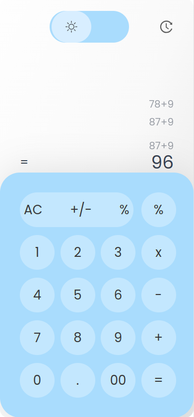
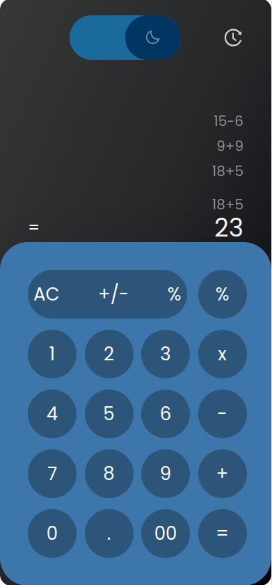

# Calculator App

This project is an Angular v14 application developed using the Tailwind CSS framework. It features a calculator that supports basic arithmetic operations such as addition, subtraction, multiplication, and division. The calculator also includes a memory feature that stores the last three calculations and displays them in the history section.
> **Note**
>
> This application is designed for mobile devices but includes responsive design.

## Features

- Four basic arithmetic operations: addition, subtraction,multiplication, and division.
- Memory function to store and display the last three calculations.
- Responsive design suitable for both mobile and desktop devices.

## Installation

Clone the repository:
```
git clone https://github.com/your-username/calculator-app.git
```

Navigate to the project directory:
```
cd calculator-app
```

Install the dependencies:

```
npm install
```
## Usage

Start the development server:

```
ng serve
```

Open your browser and navigate to http://localhost:4200 to access the calculator app.

## How to Use

- Enter numbers and perform calculations using the buttons on the calculator interface. 
- The result will be displayed in the calculator's output field.
- The memory section will show the last three calculations performed.
## Screenshots


| Light Mode                                                 | Dark Mode                                                |
|------------------------------------------------------------|----------------------------------------------------------|
|  |  |


## Contributing

Contributions are welcome! If you find any issues or have suggestions for improvements, please feel free to open an issue or submit a pull request.
License

This project is licensed under the MIT License.

## Credits

The Calculator App is created and maintained by Yunus Emre Erkesikbaş.

## Contact

For any inquiries or questions, please contact erkesikbasyunusemre@gmail.com.

Feel free to explore the project and enjoy using the Calculator App!
